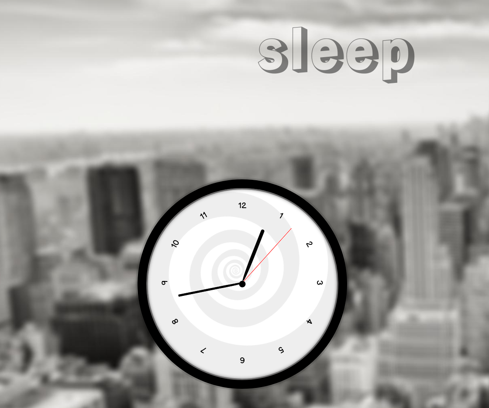

# JavaScript30 - Excercise 2: CSS & JS Clock

## Hypno Clock
This is a slightly customized version of the second excecise from [Wes Bos's JavaScript30](https://javascript30.com/)

You can view the project on [GitHub pages](https://nealbrophy.github.io/js30-hypno-clock/).

## Credits
- Inspired by the classic John Carpenter film __They Live__
- Clock implementation based on Wes Bos excercise and [this WebDevSimplified tutorial](https://www.youtube.com/watch?v=Ki0XXrlKlHY)
- Hypno spinner based on [this JSFiddle](https://jsfiddle.net/j08691/CKWrN/)
- Background image is [this picture](https://unsplash.com/photos/yb0Qs65aZmc) by Anders Jilden
